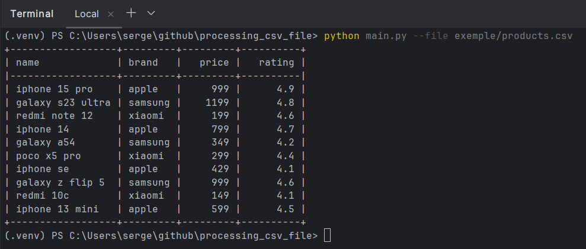
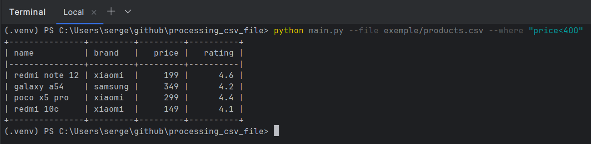
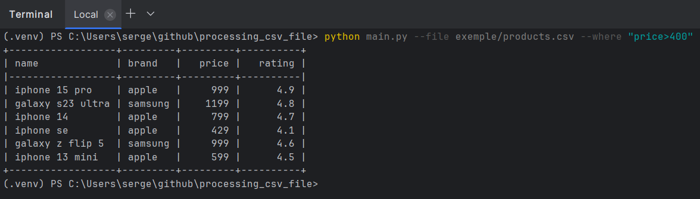
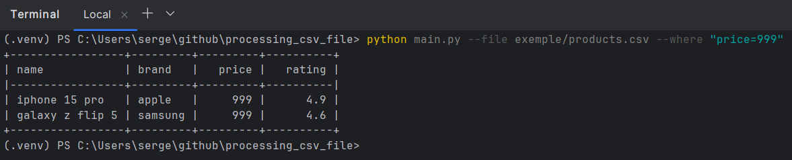
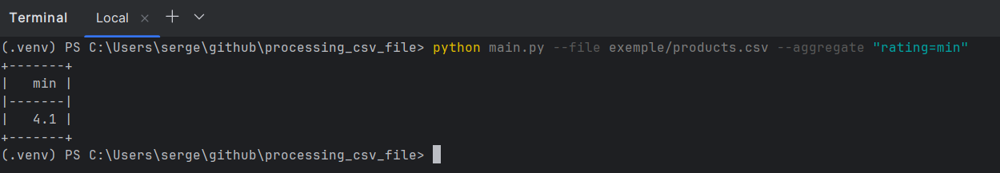
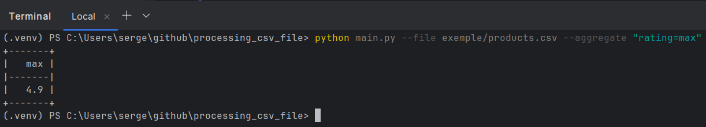
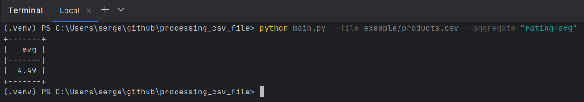
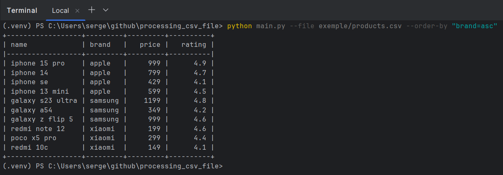
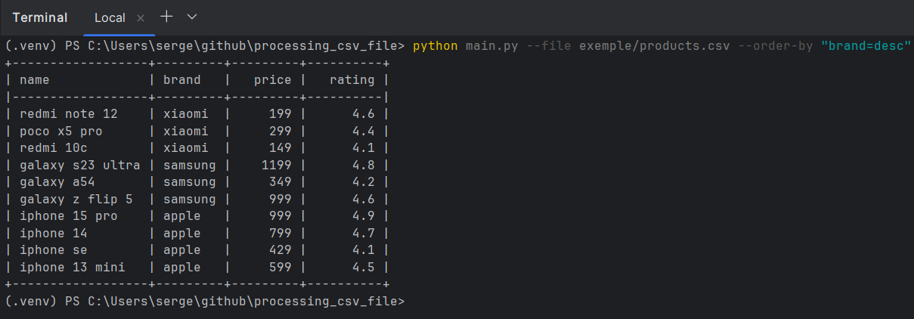
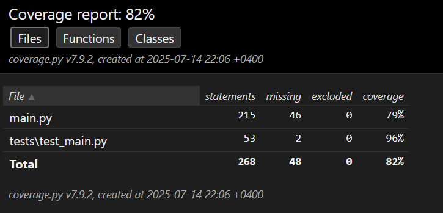

# Processing csv-file

Processing csv-file - это скрипт для обработки CSV-файла, поддерживающий следующие операции:
- фильтрация с операторами «больше», «меньше» и «равно»; 
- агрегация с расчетом среднего (avg), минимального (min) и максимального (max) значения;
- сортировка по возрастанию (asc) и по убыванию (desc).

## Параметры запуска

Для использования скрипта необходимо:
1. Клонировать данный репозиторий
2. Создать и активировать виртуальное окружение в директории скрипта
3. Установить необходимые зависимости (pip install -r requirements.txt)
4. В терминале в директории скрипта запустить:

- для вывода исходной таблицы:  
    python main.py --file file_name

- для фильтрации таблицы:  
    - python main.py --file file_name --where "column>value"  
    - python main.py --file file_name --where "column<value"  
    - python main.py --file file_name --where "column=value"

- для агрегации значений таблицы:  
    - python main.py --file file_name --aggregate "column=min"  
    - python main.py --file file_name --aggregate "column=max"  
    - python main.py --file file_name --aggregate "column=avg"

- для сортировки таблицы:  
    - python main.py --file file_name --order-by "column=asc"  
    - python main.py --file file_name --order-by "column=asc"

где необходимо заменить следующие параметры:  
file_name - путь к файлу;  
column - столбец таблицы;  
value - значение.

## Примеры запуска
Запуск скрипта на примере файла [exemple/products.csv](exemple/products.csv)

### 1) Вывод таблицы в исходном состоянии
python main.py --file exemple/products.csv

### 2) Фильтрация. Вывод строк, где значение цены ниже 400
python main.py --file exemple/products.csv --where "price<400"

### 3) Фильтрация. Вывод строк, где значение цены выше 400
python main.py --file exemple/products.csv --where "price>400"

### 4) Фильтрация. Вывод строк, где значение цены равно 999
python main.py --file exemple/products.csv --where "price=999"

### 5) Агрегация. Вывод минимального рейтинга
python main.py --file exemple/products.csv --aggregate "rating=min"

### 6) Агрегация. Вывод максимального рейтинга
python main.py --file exemple/products.csv --aggregate "rating=max"

### 7) Агрегация. Вывод среднего арифметического рейтинга
python main.py --file exemple/products.csv --aggregate "rating=avg"

### 8) Сортировка. Вывод отсортированной по возрастанию бренда таблицы
python main.py --file exemple/products.csv --order-by "brand=asc"

### 9) Сортировка. Вывод отсортированной по убыванию бренда таблицы
python main.py --file exemple/products.csv --order-by "brand=desc"

## Тестирование скрипта

Скрипт протестирован с помощью pytets. 82% покрытия по pytest-cov

